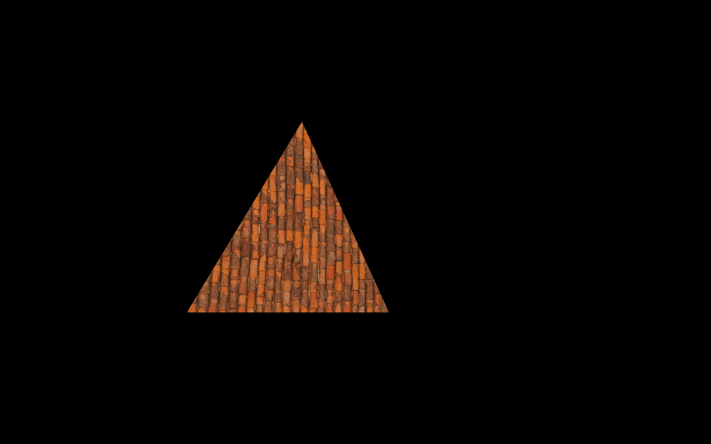
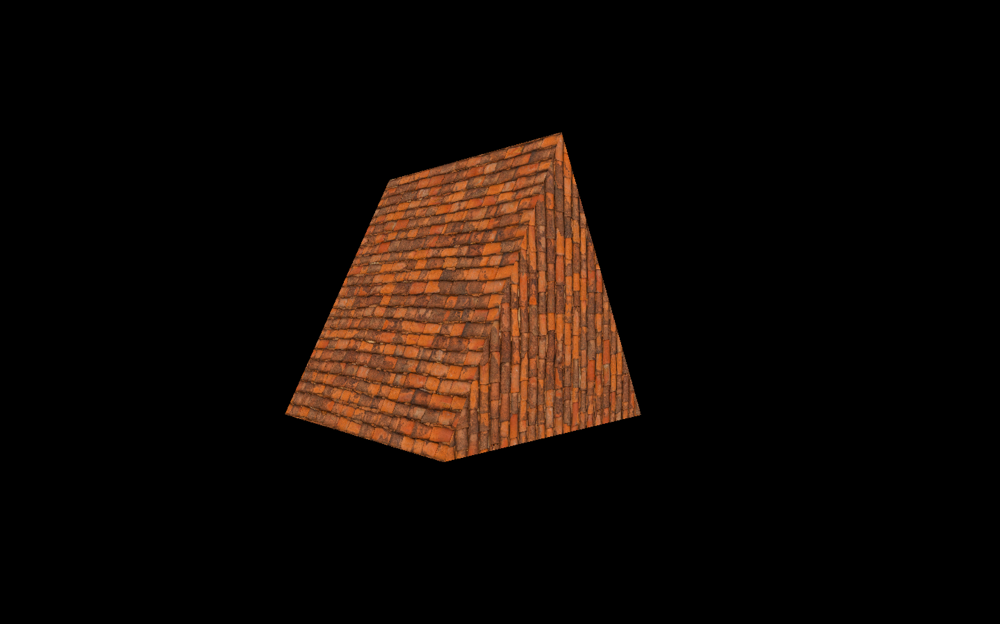
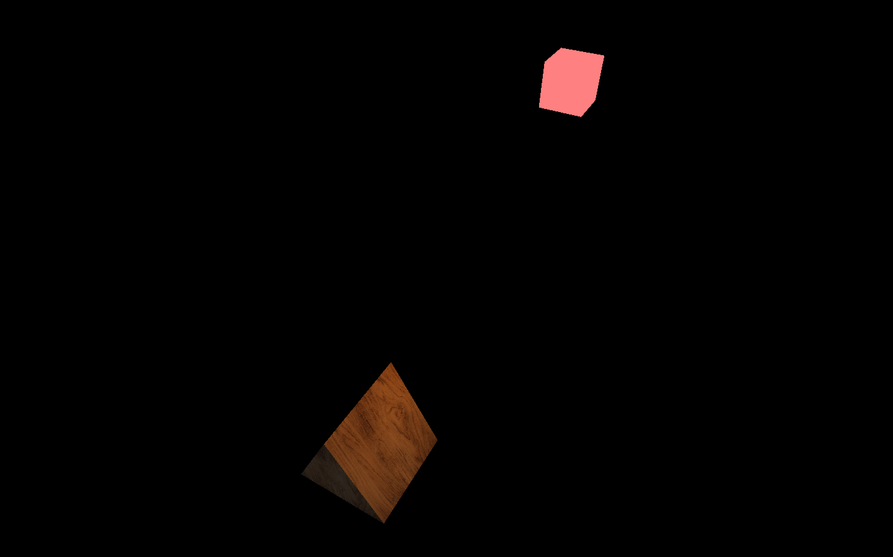

# Information

I made this repo to just keep track of what I am learning about OpenGL, how to use it properly, new concepts and testing everything.
For now I have done till textures (medium), buffer objects (pixel, vertex, index), vertex array, shaders (upper basic) and currently starting with lighting (phong model).

# Image Section

[Update 3 Feb 2026] - Added some lighting

